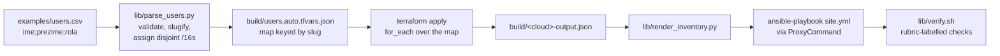

# How the deployment works

Read this before recording the video: it is the explanation the brief asks for
(*"objasniti što ona radi"*), in the order the script does things.

---

## The requirement being satisfied

> *"Skripta mora primati putanju do .csv datoteke kako bi automatski kreirala
> infrastrukturu za varijabilni broj korisnika. Skripta se pokreće jednom, ne
> pokreće se više skripti."*

One command. A CSV in, two working Moodle environments out.

```bash
./deploy.sh --csv examples/users.csv --cloud both
```

## The pipeline



Nothing between those boxes is typed by a human. That is the point of the
requirement, and it is what makes the run reproducible on camera.

## Step 1 — Preflight

Checks Terraform, Python, Ansible and the cloud credentials **before** creating
anything, so a missing `az login` costs a second rather than a half-finished
deployment.

```
[1/10] Preflight: tooling and credentials
  ok terraform 1.9.8
  ok python3 3.12.3
  ok ansible 2.21.3
  ok Azure: Azure for Students
  ok OpenStack: https://openstack.lab.example.edu:5000/v3 (project proj-...)
```

## Step 2 — Parse and validate the CSV

`lib/parse_users.py` does four jobs, and each prevents a specific failure.

**Validation.** Missing columns, unknown roles, no lead, no developers — all
rejected before any API call:

```
CSV validation failed:
  line 3: role 'devloper' is not one of ['developer', 'devops_lead']
```

**Slugification with diacritic folding.** Croatian names are normal input here
and Azure resource naming rejects them outright. `Đurđa Šarić` becomes `durdas`:

```bash
$ python3 lib/parse_users.py /tmp/dia.csv --summary
NAME                   ROLE          SLUG          NETWORK
Đurđa Šarić            developer     durdas        10.10.0.0/16
Ivan Ivić              developer     ivani         10.11.0.0/16
Ana Anić               devops_lead   anaa          (shared hub)
```

Unicode NFKD splits a base character from its combining mark; dropping the marks
leaves ASCII. Croatian `đ` has no combining form so it is mapped explicitly.

**Collision detection.** `luka lukic` and `luka lazic` both slugify to `lukal`,
which would collide on a storage account name. The script refuses rather than
letting Terraform fail mid-apply:

```
these users collapse to the same resource name: lukal
  Resource names must be unique; disambiguate the CSV.
```

**Address allocation.** Each developer gets a `/16` indexed by position, so
overlap is impossible by construction rather than by review — and overlap is the
single cheapest way to fail the network isolation requirement.

```
developer 0 -> 10.10.0.0/16, app subnet 10.10.1.0/24
developer 1 -> 10.11.0.0/16, app subnet 10.11.1.0/24
```

**Output is a map keyed by slug, not a list.** This matters more than it looks:

```json
{ "developers": { "marion": {...}, "andrijam": {...} } }
```

Terraform's `for_each` over a map keys state by the slug. Appending a third row
creates one new environment while preserving existing network and placement
slots. A list-indexed resource model would instead renumber Terraform addresses.

## Step 3 — Terraform

The same generated file feeds both stacks, so the two clouds cannot drift on who
exists.

```bash
terraform -chdir=iac/azure init
terraform -chdir=iac/azure validate
terraform -chdir=iac/azure plan -out=tfplan
terraform -chdir=iac/azure apply tfplan     # applies the reviewed plan, not a fresh one
```

Applying a saved plan file, rather than re-planning at apply time, is what makes
the recorded run match what was reviewed.

OpenStack uses three internal scopes, but the user still runs only
`./deploy.sh --cloud openstack`. The script first applies the
system-scoped identity/bootstrap root, then selects one Terraform workspace per
developer and exchanges the Academy admin's system token for that project's
token. Only then does it apply the management root, because the jump ports need
the developer-network IDs and RBAC grants:

```text
bootstrap identity/projects/flavors
  -> environment workspace marion
  -> environment workspace andrijam
  -> management project and multihomed jump
  -> merged output -> Ansible
```

This is still one script invocation; the split exists because Nova, Cinder and
Swift create resources in the provider token's project.

The Azure root creates, for two developers:

| Count | Resource |
|---|---|
| 1 | hub resource group, VNet, subnet, NSG, public IP, bastion VM |
| 2 | developer resource groups |
| 2 | VNets, each with an app subnet, route table and NSG |
| 4 | peerings (two per developer, hub↔spoke both directions) |
| 2 | internal load balancers with probe and rule |
| 4 | Moodle VMs (2 vCPU / 4 GB, Rocky 9) |
| 4 | data disks, attached |
| 4 | StorageV2 accounts: separate Blob and Files accounts per developer |
| 2 | user-assigned managed identities with one scoped role assignment each |
| 3 | Entra application/service-principal identities |
| 1 | custom RBAC role definition |
| 5 | VM power-role assignments (one per developer; each lead on all three groups) |

## Step 4 — Render the Ansible inventory

`lib/render_inventory.py` reads `terraform output -json` and writes a complete
inventory. Three things it decides so the roles need no logic of their own:

**The ProxyCommand.** No Moodle VM has a public address, so every Ansible
connection is forwarded through the bastion:

```yaml
ansible_ssh_common_args: "-o ProxyCommand=\"ssh -W %h:%p -q -i build/ssh/id_ed25519 techsprint@20.103.10.20\" ..."
```

**Which node hosts the database.** Node 1 gets `is_db_primary: true`; node 2 gets
the primary's address. The `database` and `moodle` roles read the flag.

**Secrets, encoded safely.** The values include an SSH private key with embedded
newlines, a base64 storage key containing `+` and `=`, and generated passwords
containing `#` and `:`. Each breaks naive YAML quoting differently, so scalars
are emitted with `json.dumps` — JSON is a subset of YAML 1.2, so a JSON string is
always a valid YAML scalar. The file is written mode `0600` and is gitignored.

## Step 5 — Ansible

```
PLAY [Prepare the data disk and mount both storage services]
PLAY [Install and configure Moodle]
PLAY [Configure the bastion]
```

The parts worth explaining on camera:

**Data disk discovery.** Azure uses the configured LUN 10 udev path so a
temporary disk cannot be selected accidentally. OpenStack requires exactly one
non-root disk. Both are formatted once and mounted by UUID with `nofail`.

**Both storage services mounted.** BlobFuse2 mounts Azure Blob and rclone mounts
Swift through boot-enabled systemd services. Azure Files uses SMB; OpenStack
Manila uses the native CephFS kernel client and a unique CephX key. The file
mounts are persisted through fstab.

**Moodle installed once, shared twice.** Node 1 runs the CLI installer, which
writes the database schema. Node 2 pulls the resulting `config.php` via
`delegate_to`, so both nodes serve the same site rather than two unrelated ones.
Running the installer concurrently on both would corrupt the schema.

**SELinux and firewalld.** RHEL-family images ship SELinux enforcing and
firewalld running. The playbook enables only the web/database/FUSE access Moodle
needs and opens HTTP plus the private database path.

**Moodle runtime.** EPEL/Remi supplies PHP 8.2 including sodium, while the RHEL
8.10/Rocky 9 AppStream supplies MariaDB 10.11. PHP-FPM and Apache are both
enabled before the unattended Moodle 4.5 installer runs.

## Step 6 — Verify

`lib/verify.sh` labels every check with the rubric section it satisfies, and the
isolation tests are **negative** — ICMP, SSH and HTTP must fail for every
ordered developer pair:

```
  ok    I3/I5   marion node 1: 2 vCPU
  ok    I2/I4   marion node 1: data disk mounted
  ok    I2/I4   marion node 1: object storage mounted and writable
  ok    I4      marion node 1: managed identity and root-only SMB key
  ok    I2/I4   marion cannot reach andrijam
  ok    I2/I4   marion: load balancer serves Moodle
```

Source-IP affinity pins the jump host to one backend, so repeated requests from
that source cannot prove pool membership. Verification checks both nodes
directly and leaves failover as the live demo.

## Changing the user count

The whole argument for the design, in one demonstration — worth showing in the
video:

```bash
echo 'ivan;ivic;developer' >> examples/users.csv
./deploy.sh --csv examples/users.csv --cloud azure --plan-only
```

```
Plan: <new resources> to add, 0 to change, 0 to destroy.
```

Map-keyed resources and OpenStack workspaces preserve existing developer state
when a row is appended. Azure additionally needs one quota-compatible placement
entry per developer; the current student-subscription defaults are deliberately
validated for the required two developers only. Do not claim a third Azure
environment until its region/SKU quota has been discovered and configured.

## Teardown

```bash
./deploy.sh --csv examples/users.csv --cloud azure --destroy
```

Terraform reverses the dependency graph itself. Compare with doing it by hand on
OpenStack, where a network refuses to delete while a port exists, a volume
refuses while a snapshot exists, and a router refuses while a subnet is attached
— an ordering you would otherwise have to work out and maintain yourself.

---

Previous: [Prerequisites](02-prerequisites.md) ·
Next: [Naming and tagging](04-naming-and-tagging.md)
