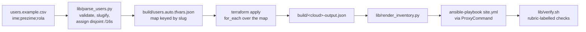

# Architecture, networking and design decisions

Architecture, networking and the reasoning behind every graded element choice,
for both clouds. This is the document to read before recording the video and the
one the report's architecture and design sections are written from.

| Section | Rubric |
|---|---|
| [How the deployment works](#how-the-deployment-works) | I2/I4 automation |
| [Design decisions](#design-decisions) | **I1, 7 pts** |
| [Azure networking](#azure-networking) | I4, 1 pt |
| [OpenStack networking](#openstack-networking) | I2, 1 pt |
| [Load balancer: Azure LB vs Application Gateway](#load-balancer-azure-lb-vs-application-gateway) | I4, 2 pts |
| [Naming convention and tagging](#naming-convention-and-tagging) | I1, 6 pts |

The four required diagrams live in [`diagrams/`](diagrams/):
[Azure architecture](diagrams/azure-architecture.md),
[OpenStack architecture](diagrams/openstack-architecture.md),
[Azure RBAC](diagrams/azure-rbac.md),
[OpenStack IAM](diagrams/openstack-iam.md).

---

## How the deployment works

Read this before recording the video: it is the explanation the brief asks for
(*"objasniti što ona radi"*), in the order the script does things.

### The requirement being satisfied

> *"Skripta mora primati putanju do .csv datoteke kako bi automatski kreirala
> infrastrukturu za varijabilni broj korisnika. Skripta se pokreće jednom, ne
> pokreće se više skripti."*

One command. A CSV in, two working Moodle environments out.

```bash
./deploy.sh --csv users.example.csv --cloud both
```

### The pipeline



Nothing between those boxes is typed by a human. That is the point of the
requirement, and it is what makes the run reproducible on camera.

### Step 1 — Preflight

Checks Terraform, Python, Ansible and the cloud credentials **before** creating
anything, so a missing `az login` costs a second rather than a half-finished
deployment.

```
[1/10] Preflight: tooling and credentials
  ok terraform 1.9.8
  ok python3 3.12.3
  ok ansible 2.21.3
  ok Azure: Azure for Students
  ok OpenStack: https://openstack.lab.example.edu:5000/v3 (project proj-...)
```

### Step 2 — Parse and validate the CSV

`lib/parse_users.py` does four jobs, and each prevents a specific failure.

**Validation.** Missing columns, unknown roles, no lead, no developers — all
rejected before any API call:

```
CSV validation failed:
  line 3: role 'devloper' is not one of ['developer', 'devops_lead']
```

**Slugification with diacritic folding.** Croatian names are normal input here
and Azure resource naming rejects them outright. `Đurđa Šarić` becomes `durdas`:

```bash
$ python3 lib/parse_users.py /tmp/dia.csv --summary
NAME                   ROLE          SLUG          NETWORK
Đurđa Šarić            developer     durdas        10.10.0.0/16
Ivan Ivić              developer     ivani         10.11.0.0/16
Ana Anić               devops_lead   anaa          (shared hub)
```

Unicode NFKD splits a base character from its combining mark; dropping the marks
leaves ASCII. Croatian `đ` has no combining form so it is mapped explicitly.

**Collision detection.** `luka lukic` and `luka lazic` both slugify to `lukal`,
which would collide on a storage account name. The script refuses rather than
letting Terraform fail mid-apply:

```
these users collapse to the same resource name: lukal
  Resource names must be unique; disambiguate the CSV.
```

**Address allocation.** Each developer gets a `/16` indexed by position, so
overlap is impossible by construction rather than by review — and overlap is the
single cheapest way to fail the network isolation requirement.

```
developer 0 -> 10.10.0.0/16, app subnet 10.10.1.0/24
developer 1 -> 10.11.0.0/16, app subnet 10.11.1.0/24
```

**Output is a map keyed by slug, not a list.** This matters more than it looks:

```json
{ "developers": { "marion": {...}, "andrijam": {...} } }
```

Terraform's `for_each` over a map keys state by the slug. Appending a third row
creates one new environment while preserving existing network and placement
slots. A list-indexed resource model would instead renumber Terraform addresses.

### Step 3 — Terraform

The same generated file feeds both stacks, so the two clouds cannot drift on who
exists.

```bash
terraform -chdir=iac/azure init
terraform -chdir=iac/azure validate
terraform -chdir=iac/azure plan -out=tfplan
terraform -chdir=iac/azure apply tfplan     # applies the reviewed plan, not a fresh one
```

Applying a saved plan file, rather than re-planning at apply time, is what makes
the recorded run match what was reviewed.

OpenStack uses two roots, but the user still runs only
`./deploy.sh --cloud openstack`. The script applies the system-scoped
identity/bootstrap root first, then the data root, which holds every tenant
resource and the jump host:

```text
iac/openstack        identity, projects, users, groups, roles, flavors
  -> iac/openstack/data
       one provider alias per project
       developer networks, instances, volumes, load balancers, storage
       management project and the multihomed jump
  -> single terraform output -> Ansible
```

The split exists because Nova, Cinder, Swift and Manila always create in the
project their token is scoped to, and a Terraform provider cannot be configured
for a project that does not exist yet. Neutron and Octavia resources do accept
an explicit `tenant_id`, which is why only these four services force the
per-project providers.

Because provider aliases cannot be generated with `for_each`, the data root
declares a fixed number of developer slots — three today. Adding a fourth
OpenStack developer means adding one provider block and one module block, and a
variable validation fails with exactly that instruction rather than doing
something surprising. The variable-user-count requirement is demonstrated on
Azure, which has no such limit.

The Azure root creates, for two developers:

| Count | Resource |
|---|---|
| 1 | hub resource group, VNet, subnet, NSG, public IP, bastion VM |
| 2 | developer resource groups |
| 2 | VNets, each with an app subnet, route table and NSG |
| 4 | peerings (two per developer, hub↔spoke both directions) |
| 2 | internal load balancers with probe and rule |
| 4 | Moodle VMs (2 vCPU / 4 GB, Rocky 9) |
| 4 | data disks, attached |
| 4 | StorageV2 accounts: separate Blob and Files accounts per developer |
| 2 | user-assigned managed identities with one scoped role assignment each |
| 3 | Entra application/service-principal identities |
| 1 | custom RBAC role definition |
| 5 | VM power-role assignments (one per developer; each lead on all three groups) |

### Step 4 — Render the Ansible inventory

`lib/render_inventory.py` reads `terraform output -json` and writes a complete
inventory. Three things it decides so the roles need no logic of their own:

**The ProxyCommand.** No Moodle VM has a public address, so every Ansible
connection is forwarded through the bastion:

```yaml
ansible_ssh_common_args: "-o ProxyCommand=\"ssh -W %h:%p -q -i build/ssh/id_ed25519 techsprint@20.103.10.20\" ..."
```

**Which node hosts the database.** Node 1 gets `is_db_primary: true`; node 2 gets
the primary's address. The `database` and `moodle` roles read the flag.

**Secrets, encoded safely.** The values include an SSH private key with embedded
newlines, a base64 storage key containing `+` and `=`, and generated passwords
containing `#` and `:`. Each breaks naive YAML quoting differently, so scalars
are emitted with `json.dumps` — JSON is a subset of YAML 1.2, so a JSON string is
always a valid YAML scalar. The file is written mode `0600` and is gitignored.

### Step 5 — Ansible

```
PLAY [Prepare the data disk and mount both storage services]
PLAY [Install and configure Moodle]
PLAY [Configure the bastion]
```

The parts worth explaining on camera:

**Data disk discovery.** Azure uses the configured LUN 10 udev path so a
temporary disk cannot be selected accidentally. OpenStack requires exactly one
non-root disk. Both are formatted once and mounted by UUID with `nofail`.

**Both storage services mounted.** BlobFuse2 mounts Azure Blob and rclone mounts
Swift through boot-enabled systemd services. Azure Files uses SMB; OpenStack
Manila uses the native CephFS kernel client and a unique CephX key. The file
mounts are persisted through fstab.

**Moodle installed once, shared twice.** Node 1 runs the CLI installer, which
writes the database schema. Node 2 pulls the resulting `config.php` via
`delegate_to`, so both nodes serve the same site rather than two unrelated ones.
Running the installer concurrently on both would corrupt the schema.

**SELinux and firewalld.** RHEL-family images ship SELinux enforcing and
firewalld running. The playbook enables only the web/database/FUSE access Moodle
needs and opens HTTP plus the private database path.

**Moodle runtime.** EPEL/Remi supplies PHP 8.2 including sodium, while the RHEL
8.10/Rocky 9 AppStream supplies MariaDB 10.11. PHP-FPM and Apache are both
enabled before the unattended Moodle 4.5 installer runs.

### Step 6 — Verify

`lib/verify.sh` labels every check with the rubric section it satisfies, and the
isolation tests are **negative** — ICMP, SSH and HTTP must fail for every
ordered developer pair:

```
  ok    I3/I5   marion node 1: 2 vCPU
  ok    I2/I4   marion node 1: data disk mounted
  ok    I2/I4   marion node 1: object storage mounted and writable
  ok    I4      marion node 1: managed identity and root-only SMB key
  ok    I2/I4   marion cannot reach andrijam
  ok    I2/I4   marion: load balancer serves Moodle
```

Source-IP affinity pins the jump host to one backend, so repeated requests from
that source cannot prove pool membership. Verification checks both nodes
directly and leaves failover as the live demo.

### Changing the user count

The whole argument for the design, in one demonstration — worth showing in the
video:

```bash
echo 'ivan;ivic;developer' >> users.example.csv
./deploy.sh --csv users.example.csv --cloud azure --plan-only
```

```
Plan: <new resources> to add, 0 to change, 0 to destroy.
```

Map-keyed resources preserve existing developer state when a row is appended,
and the OpenStack slot order is pinned to `network_index` so an existing
developer never moves to another provider alias. Azure additionally needs one
quota-compatible placement
entry per developer; the current student-subscription defaults are deliberately
validated for the required two developers only. Do not claim a third Azure
environment until its region/SKU quota has been discovered and configured.

### Teardown

```bash
./deploy.sh --csv users.example.csv --cloud azure --destroy
```

Terraform reverses the dependency graph itself. Compare with doing it by hand on
OpenStack, where a network refuses to delete while a port exists, a volume
refuses while a snapshot exists, and a router refuses while a subnet is attached
— an ordering you would otherwise have to work out and maintain yourself.

---

## Design decisions

**Worth 7 points (I1)** — the single largest scored item in the brief:
*"Objašnjenje odabira elemenata (Load balancer, Objektna/Datotečna pohrana, Tip
VM-a, Tip diska)"*.

Four decisions, each with what was chosen, what was rejected, and why. Copy the
structure into the report; the marks are for the reasoning, not the choice.

### 0. Azure for Students placement and egress

The subscription permits only six vCPUs per region. The official minimum needs
four 2-vCPU Moodle VMs plus a 1-vCPU lead/jump VM, so a single-region deployment
cannot fit. Region is not fixed by the brief, therefore the tested placement is:

| Region | Resources | Regional vCPUs |
|---|---|---|
| Denmark East | Mario's two `Standard_B2s` VMs + `Standard_A1_v2` jump/lead | 5 |
| Austria East | Andrija's two `Standard_D2ls_v6` VMs | 4 |

Both application sizes provide exactly 2 vCPU and 4 GB RAM. Global VNet peering
joins each isolated developer VNet to the central VNet; it does not create a
route between developers.

The rubric literally allows a public IP only on the jump host. Per-spoke NAT
Gateways were therefore rejected because each requires another public IP. Each
spoke instead has a default route to the jump VM, whose NIC has IP forwarding
enabled and whose `nftables` rule performs outbound-only source NAT. This is
cheaper and rubric-compatible, at the cost of making the jump VM an egress
single point of failure.

### 1. Load balancer

#### Azure: Standard Load Balancer, internal

| Option | Layer | Cost/month | Verdict |
|---|---|---|---|
| **Standard Load Balancer, internal** | 4 (TCP) | ~18 EUR + data | **Chosen** |
| Application Gateway v2 | 7 (HTTP) | ~125 EUR + capacity units | Rejected: 5× the cost of everything else per developer |
| Basic Load Balancer | 4 | free | Rejected: retired September 2025, no SLA |
| nginx on a third VM | 7 | ~30 EUR (another B2s) | Rejected: another VM to patch, and it is a single point of failure |

**Internal, not public.** The brief forbids public access to anything but the
jump host, so a public frontend would contradict a graded requirement. Moodle is
reached through an SSH tunnel via the bastion. The detailed Azure LB versus
Application Gateway comparison, which the rubric asks for separately, is in
[Load balancer: Azure LB vs Application Gateway](#load-balancer-azure-lb-vs-application-gateway)
below.

**Health probe on `/healthz.php`, not TCP:80.** A TCP probe only proves that
Apache accepted a connection. The HTTP endpoint returns 503 unless Moodle's
config, database, data disk, object mount and file mount are all available and
writable where required. Ansible configures those dependencies before running
the installer, so a node joins the pool only when it can serve Moodle safely.

**`load_distribution = "SourceIP"`.** Moodle keeps session state on the node
that created it unless sessions are externalised to Redis or the database. With
the default five-tuple distribution a user's requests alternate between nodes
and they are logged out on roughly every second click. Source-IP affinity pins
each client to one backend. The production fix is a shared session store; that
is out of scope here and recorded in
[known limitations](cloud-comparison.md#known-limitations).

#### OpenStack: Octavia Amphora `SINGLE`

The RHOSP 16.1 lab exposes both OVN and Amphora providers. OVN is lightweight
and consumes no guest VM, but this release does not implement health monitors.
The project therefore creates an Octavia flavor profile selecting Amphora
`SINGLE` with the existing 1-vCPU/1-GB `octavia_65` flavor. Each developer gets
one managed amphora and the same HTTP `/healthz.php` monitor used on Azure.

Placement discovery showed enough allocation capacity for four 4-GB application
VMs, the central jump and two 1-GB amphorae. This choice costs more lab capacity
than OVN but supports the failure detection needed for a defensible HA demo.

### 2. Object storage and file storage

The brief asks for **both**, per developer, both auto-mounted. They are not
interchangeable, and saying why is most of the marks.

| | Object storage | File storage |
|---|---|---|
| Azure | Blob container `moodle-files` | Azure Files share `moodle-backups` |
| OpenStack | Swift container | Manila native CephFS share |
| Access | BlobFuse2/rclone FUSE mount | SMB (Azure) / CephFS kernel client |
| Protocol | HTTP verbs | SMB (Azure) / NFS (OpenStack) |
| Good at | Cheap, effectively unlimited, versioned, lifecycle-managed | Random access, `tar`, existing tools that expect a path |
| Bad at | No partial writes, no locking, no rename | More expensive per GB, throughput limits, needs a mount |
| Used for | Moodle's uploaded files and resources | Backup archives |

**Why that split.** Moodle's file API is content-addressed — it stores files by
hash and rarely rewrites them in place — which is the application pattern most
compatible with an object-backed FUSE mount. BlobFuse2 presents the required
container at `/var/moodledata` on both Azure nodes. It runs with direct I/O and
writeback caching disabled so two mounts do not serve stale local cache data.
Blob storage still lacks full POSIX locking; this is acceptable only for the
small test deployment and is recorded as a limitation. Backups are the
opposite: `tar` needs a conventional path it can stream into and later read
back, so a mounted file share is the right tool.

**Least privilege, which is separately scored (2 points each side).**

On Azure, the Moodle nodes reach blob storage through a **user-assigned managed
identity** holding `Storage Blob Data Contributor` scoped to **one container** —
not the storage account. BlobFuse2 authenticates with that identity and mounts
the container automatically through systemd. No account key is present in the
BlobFuse configuration, and the identity cannot read the backup share.
`lib/verify.sh` asserts the authentication mode rather than trusting it:

```bash
check "I4" "blob configuration uses managed identity" \
  on_node "$ip" "grep -q 'mode: msi' /etc/blobfuse2-techsprint.yaml"
```

Blob and Files use separate accounts. The Files SMB key lives in a root-owned
mode-`0600` credential file, but cannot access the Blob account. Both accounts
deny network access by default and allow only the developer subnet plus the
deployment workstation while Terraform creates the container/share.

On OpenStack, each environment receives a dedicated `svc-...-swift` identity
with only `swiftoperator` in that developer project. Its credential is mode
`0600`, owned by the Apache account running the rclone mount, and cannot operate
Nova or another project. Manila creates a native CephFS share and a unique
CephX identity/key per environment.

### 3. VM type

The brief fixes the application size at 2 vCPU and 4 GB. SKU capabilities were
queried rather than inferred from names because student subscriptions expose a
restricted set in each region.

| Size | Region | vCPU | RAM | Notes |
|---|---|---|---|---|
| **Standard_B2s** | Denmark East | 2 | 4 GB | Chosen for developer 1; burstable and quota-compatible |
| **Standard_D2ls_v6** | Austria East | 2 | 4 GB | Chosen for developer 2; the available exact-fit SKU |
| **Standard_D2ls_v6** | Belgium Central | 2 | 4 GB | Reserved for the appended third-developer plan demonstration |
| **Standard_A1_v2** | Denmark East | 1 | 2 GB | Jump/lead VM; separate family keeps Denmark within quota |

**Why mixed SKUs.** A single SKU is aesthetically simpler but impossible under
the available regional capacity. Each developer remains internally consistent:
both of their nodes use the same shape. The application sees the required CPU
and memory in either region, while Terraform verifies the placement explicitly.

**The trade-off, which must be stated.** B-series accrue CPU credits when below
their baseline (B2s baseline is 40% of two cores) and spend them above it. Once
credits are exhausted, the VM is throttled to baseline — and `Percentage CPU`
still reads healthy while everything feels slow. This appears in practice during
Moodle's initial install, which is CPU-heavy for several minutes.

If your demo includes a load test, watch the credit metric, not just CPU:

```bash
az monitor metrics list --resource "$VM_ID" \
  --metric "CPU Credits Remaining" --interval PT1M --aggregation Average \
  --query "value[0].timeseries[0].data[-5:].{time:timeStamp, credits:average}" -o table
```

For a production Moodle serving real students, D2s_v3 or larger is correct
because the load is sustained rather than bursty. Saying that shows you
understand *why* the sizes differ rather than which is cheaper.

**Jump host: A1_v2.** It forwards SSH and low-volume package-download traffic.
Using the Av2 family avoids consuming the four B-family vCPUs reserved for the
Denmark developer environment.

**OpenStack:** pick the flavor whose actual vCPU and RAM match, not whose name
looks right. Flavor names are site-specific and frequently misleading:

```bash
openstack flavor list -f table
openstack flavor show m1.medium -c vcpus -c ram -c disk
# vcpus 2, ram 4096  <- verify, do not assume
```

`lib/verify.sh` checks `nproc` and `/proc/meminfo` on the running guest, so a
mismatched flavor fails the run rather than quietly losing the point.

### 4. Disk type

Two disks per VM, as required. They have different jobs and therefore different
answers.

| Disk | Purpose | Azure choice | Size | OpenStack choice |
|---|---|---|---|---|
| OS disk | Rocky Linux, Apache, PHP, Moodle code | StandardSSD_LRS | 64 GB | boot volume from image |
| Data disk | `/mnt/techsprint-data` — local cache and staging | StandardSSD_LRS | 32 GB | Cinder volume |

| Azure disk type | IOPS (small) | ~EUR/month (64 GB) | Verdict |
|---|---|---|---|
| Standard HDD | ~500 | ~2.50 | Rejected: latency makes Moodle's admin pages feel broken |
| **Standard SSD** | ~500 baseline, burst to 1000 | ~4.50 | **Chosen** |
| Premium SSD | 240 provisioned | ~9.00 | Rejected: 2× the price for IOPS this workload never reaches |
| Premium SSD v2 | configurable | ~10+ | Rejected: no free-tier benefit, more moving parts |

**Why Standard SSD.** Moodle is latency-sensitive on small random reads — every
page load touches many small PHP files and rows — and Standard HDD's ~10 ms
seek time is felt directly in the browser. Premium SSD's provisioned IOPS solve
a throughput problem this workload does not have. Standard SSD sits at the point
where the interface is fast enough and the bill is not.

**Why a separate data disk at all**, beyond the brief requiring two:

1. BlobFuse2's local cache and temporary backup staging cannot fill the OS disk.
2. It can be resized or rebuilt independently from the system disk.
3. It visibly satisfies and demonstrates the required second mounted disk while
   shared Moodle content remains in the object-storage mount.

**Mounted by UUID, with `nofail`** — both deliberate:

```
UUID=8f3a... /mnt/techsprint-data xfs defaults,nofail 0 2
```

Device names are not stable. Attach one more volume and yesterday's `/dev/sdc`
can become `/dev/sdd`, mounting the filesystem in the wrong place or not at all.
`nofail` means a missing volume degrades to a missing mount rather than dropping
the instance into emergency mode — where a cloud VM has no console to recover
from. The verifier checks the resulting mount.

**XFS over ext4.** Both work. XFS is the RHEL-family default, handles many small
files well, and supports online growth (`xfs_growfs`) after expanding the disk,
which is the realistic maintenance operation here.

### Decision summary for the report

| Decision | Chosen | Rejected | Deciding reason |
|---|---|---|---|
| Load balancer (Azure) | Standard LB, internal | Application Gateway | ~125 vs ~18 EUR/month; L7 features unused |
| Load balancer (OpenStack) | Amphora `SINGLE` | OVN | RHOSP 16.1 OVN has no health monitors |
| Health probe | HTTP `/healthz.php` | TCP:80 | HTTP verifies the configured web path and exposes node identity |
| Session handling | Source-IP affinity | round robin | Moodle keeps per-node session state |
| Object storage | Blob / Swift through FUSE | file share for everything | Matches Moodle's content-addressed file API |
| File storage | Azure Files / native CephFS | blob for everything | `tar` needs a conventional mounted path |
| Blob mount identity | Managed identity, one container | account key in BlobFuse | No long-lived secret in the Blob configuration |
| Azure storage layout | separate Blob and Files accounts | one shared account | SMB key cannot bypass Blob managed identity |
| Azure placement | Denmark + Austria | one region | Six-vCPU student quota cannot fit the nine-vCPU minimum |
| Outbound access | jump host as NVA/NAT | NAT Gateway per spoke | preserves the single-public-IP requirement |
| VM size | B2s + D2ls_v6 | one unavailable SKU everywhere | both selected sizes are exactly 2 vCPU / 4 GB |
| Disk type | Standard SSD | Premium SSD / Standard HDD | HDD latency is user-visible; Premium IOPS unused |
| Disk layout | separate cache/staging disk | single disk | Independent lifecycle; cache cannot wedge the OS |
| Mount method | UUID + `nofail` | device name | Device order is unstable; `nofail` avoids emergency mode |

---

## Azure networking

**Worth 1 point (I4)** — *"Adekvatno objašnjenje Azure mrežnih postavki"* — but
it also underpins the 2 points for isolation and the 1 point for NSGs/ASGs.

Diagram: [diagrams/azure-architecture.md](diagrams/azure-architecture.md).

### Address plan

| Range | Purpose | Reserved |
|---|---|---|
| `10.0.0.0/16` | hub VNet | — |
| `10.0.1.0/24` | `snet-jump`, the bastion | Azure takes 5 addresses |
| `10.10.0.0/16` | developer 0 VNet | — |
| `10.10.1.0/24` | `snet-app`, Moodle + LB frontend at `.250` | Azure takes 5 |
| `10.11.0.0/16` | developer 1 VNet | — |
| `10.11.1.0/24` | developer 1 app subnet | Azure takes 5 |

A `/16` per developer, indexed by CSV position in `lib/parse_users.py`, so
overlap is impossible by construction. Terraform re-checks it anyway:

```hcl
validation {
  condition     = length(distinct([for dev in var.developers : dev.vnet_cidr])) == length(var.developers)
  error_message = "Every developer needs a distinct vnet_cidr."
}
```

Azure reserves 5 addresses per subnet: `.0` network, `.1` gateway, `.2` and `.3`
for DNS mapping, `.255` broadcast. A `/24` therefore yields 251 usable, which is
why subnets are not sized to the bone.

### Isolation: why hub-and-spoke works

Two requirements conflict. The lead must reach every VM; developers must reach
only their own. Hub-and-spoke resolves it because **VNet peering is not
transitive**.

Each spoke has exactly one peering, to the hub. The hub does run a forwarding
appliance, but spoke route tables send only `0.0.0.0/0` to it for Internet
egress. The NVA subnet NSG permits forwarded packets only when their destination
is the `Internet` service tag; Azure's default inbound deny rejects every other
forwarded flow. The jump host's nftables policy independently drops traffic
whose source and destination are both private.

```hcl
resource "azurerm_virtual_network_peering" "spoke_to_hub" {
  allow_virtual_network_access = true
  allow_forwarded_traffic      = true    # required for controlled NVA egress
  allow_gateway_transit        = false
  use_remote_gateways          = false
}
```

Forwarding is therefore explicit rather than broadly trusted: the route, NVA
firewall and hub NSG all have to agree. Direct spoke-to-spoke traffic has no
peering route at all.

```bash
# Each spoke has one peering, pointing at the hub, with controlled forwarding
az network vnet peering list -g rg-techsprint-test-marion \
  --vnet-name vnet-techsprint-test-marion \
  --query "[].{name:name, state:peeringState, forwarded:allowForwardedTraffic}" -o table
```

### NSG rules and why each exists

Attached to the **subnet**, not the NIC, so every VM added later inherits them
and there is one place to audit.

| Priority | Rule | Source | Port | Reason |
|---|---|---|---|---|
| 100 | `allow-ssh-http-from-hub` | hub CIDR | 22, 80 | The bastion is the only management/application path in |
| 110 | `allow-http-from-loadbalancer` | `AzureLoadBalancer` | 80 | Health probes |
| 120 | `allow-moodle-peer-db-and-http` | the Moodle ASG | 80, 3306 | Node 2 reaches node 1's MariaDB; scoped to group members |
| 65000 | `AllowVnetInBound` | platform | * | Cannot be removed |
| 65500 | `DenyAllInBound` | platform | * | Cannot be removed — the default posture |

Two points to make in the report:

**NSGs are default-deny inbound, default-allow outbound.** The 65000-series rules
are platform defaults you inherit and cannot delete. Your rules only ever *open*
things. Knowing this shows you understand the model rather than having pasted
rules until something worked.

### Application security groups

An ASG lets a rule name a *role* instead of an address range.

```hcl
source_application_security_group_ids      = [azurerm_application_security_group.moodle.id]
destination_application_security_group_ids = [azurerm_application_security_group.moodle.id]
```

The MariaDB rule reads "from Moodle nodes to Moodle nodes on 3306" rather than
"from 10.10.1.0/24 to 10.10.1.0/24". Two consequences: adding a third Moodle node
needs no rule edit, and the rule cannot accidentally admit a non-Moodle VM that
happens to sit in the same subnet.

Only Moodle NICs join the ASG. The jump host is already isolated in its own
subnet and resource group, so a second single-member ASG would add no control.

### Egress without ingress

*"Virtualne mašine moraju moći pristupiti Internetu radi preuzimanja paketa"* —
but the rubric also permits a public IP only on the jump host. A user-defined
route sends default traffic to that jump VM:

```hcl
resource "azurerm_route" "default_via_jump" {
  address_prefix         = "0.0.0.0/0"
  next_hop_type          = "VirtualAppliance"
  next_hop_in_ip_address = var.hub_private_ip
}
```

Why not the alternatives:

| Option | Problem |
|---|---|
| Public IP per VM | Directly violates "javni IP isključivo na Jump hostu" |
| Default outbound access | Being retired (September 2025); also prone to SNAT port exhaustion |
| Load balancer outbound rules | Works, but couples egress to the LB's lifecycle |
| NAT gateway per spoke | Requires two additional public IP resources |
| **Jump VM as NVA/NAT** | Reuses the sole permitted public IP; sufficient for a small test environment |

The jump NIC enables IP forwarding, Ubuntu enables `net.ipv4.ip_forward`, and
`nftables` applies both source NAT and a default-drop forward policy that rejects
private cross-spoke destinations. This is intentionally a student-scale choice:
it is cheaper and rubric-compatible, but it makes package downloads depend on
the jump VM.

For traffic originating on the jump host, its NSG allows only SSH and HTTP to
each developer CIDR, then denies other `10.0.0.0/8` destinations. This prevents
the bastion from pivoting directly to MariaDB or unrelated private services.

### Storage access

Each developer has separate Blob and Files accounts. BlobFuse authenticates
with a managed identity scoped to one private container; the Files key therefore
cannot bypass that boundary. Both accounts deny network access by default. A
`Microsoft.Storage` service endpoint admits the developer subnet, while one
workstation-IP exception lets Terraform create the container and share.

### Verifying the whole story

```bash
# 1. No Moodle VM has a public IP
az network nic list --query \
  "[?contains(resourceGroup,'techsprint')].{nic:name, publicIp:ipConfigurations[0].publicIpAddress.id}" -o table
# publicIp must be null for every NIC except the bastion's

# 2. Ask Azure to trace a packet - it names the exact rule that decided
az network watcher test-ip-flow \
  -g rg-techsprint-test-marion --vm vm-techsprint-test-marion-moodle-1 \
  --direction Inbound --protocol TCP --local 10.10.1.4:22 --remote 10.0.1.4:33000
# Access: Allow, Rule: allow-ssh-http-from-hub

az network watcher test-ip-flow \
  -g rg-techsprint-test-marion --vm vm-techsprint-test-marion-moodle-1 \
  --direction Inbound --protocol TCP --local 10.10.1.4:22 --remote 10.11.1.4:33000
# Access: Deny, Rule: DenyAllInBound
```

`test-ip-flow` is the best NSG evidence available and almost nobody uses it: it
returns the rule name that allowed or denied a specific packet. Two invocations
— one allowed from the hub, one denied from a peer developer — prove the
isolation design in a way a rule listing cannot.

```bash
# 3. Effective rules on the NIC, which catches a second NSG overriding the subnet one
az network nic list-effective-nsg -g rg-techsprint-test-marion \
  -n nic-techsprint-test-marion-moodle-1 -o table
```

---

## OpenStack networking

**Worth 1 point (I2)** — *"Adekvatno objašnjenje specifičnih mrežnih postavki"* —
and it underpins the 2 points for isolation and 1 for security groups.

Diagram: [diagrams/openstack-architecture.md](diagrams/openstack-architecture.md).

### Identity isolation and packet isolation are different controls

Keystone projects are the **control-plane** boundary: a user without a role in
another project cannot obtain a token scoped to it or operate its servers.
Neutron networks, routes and security groups are the **data-plane** boundary:
they determine whether one packet can reach another VM. Keystone denial alone
does not stop a VM from sending traffic to an address for which a route exists.

The implementation uses both. Every developer receives a separate project and
a disjoint private network. A project-specific Neutron RBAC policy shares that
network only with the management project. The management project then owns a
fixed `.253` port on it, attached to the central jump VM. The control-plane probe
proved this cross-project port model before it was encoded in Terraform.

```hcl
resource "openstack_networking_network_v2" "env" {
  name      = "net-${local.env_name}"
  tenant_id = var.project_id      # <- the isolation
}
```

The CIDRs must remain disjoint because one multihomed jump VM is attached to
every network. Repeated ranges would create ambiguous routes on that VM.

### Layer by layer

| Layer | Resource | Purpose |
|---|---|---|
| L2 | `openstack_networking_network_v2` | The tenant network |
| L3 | `openstack_networking_subnet_v2` | CIDR, DHCP, DNS resolvers |
| Routing | `openstack_networking_router_v2` | External gateway; SNAT for egress |
| Attachment | `openstack_networking_router_interface_v2` | Gives the router an address in the subnet (`.1`) |
| Port | `openstack_networking_port_v2` | The instance's NIC; carries the security groups |
| Management grant | `openstack_networking_rbac_policy_v2` | Lets only the management project own a jump port on this network |
| Firewall | `openstack_networking_secgroup_v2` | Allow-only ingress rules |
| Ingress | `openstack_networking_floatingip_v2` | One, on the bastion only |

Order matters when building by hand: the external gateway must be set **before**
the internal interface, or Neutron has nowhere to SNAT tenant traffic to.
Terraform derives that order from the dependency graph, which is exactly the
argument for declarative provisioning.

### Egress: router SNAT

*"Virtualne mašine moraju moći pristupiti Internetu radi preuzimanja paketa."*

```hcl
resource "openstack_networking_router_v2" "env" {
  external_network_id = var.external_network_id
}
```

Attaching an external gateway enables SNAT by default, so every instance in the
subnet reaches the internet through the router's external address, and nothing
outside can initiate a connection inward. No floating IP on any Moodle instance
means no inbound path exists at all.

```bash
openstack router show router-techsprint-test-marion -f value -c external_gateway_info
# {"network_id": "...", "enable_snat": true, "external_fixed_ips": [...]}
```

`enable_snat: true` plus a non-empty `external_fixed_ips` is the healthy state.
An empty `external_gateway_info` means the gateway did not attach — usually your
role lacks permission, or the provider network name is wrong.

### The floating IP is DNAT, not an interface

Every student trips over this once, so explaining it correctly is worth the
point. The floating IP is **not** configured on the instance; the router performs
DNAT. Inside the bastion, `ip addr` shows only the fixed address, forever.

```bash
openstack floating ip list -f table
# | Floating IP Address | Fixed IP Address |
# | 172.25.250.108      | 10.100.0.12      |

ssh cloud-user@172.25.250.108 'ip -4 addr show | grep inet'
#     inet 10.100.0.12/24        <- the floating IP appears nowhere
```

Compare with Azure, where a public IP is a resource *associated with a NIC* and
the model is more literal. Same outcome, different mental model — a good line for
the comparison section.

### Security groups: allow-only

Neutron security groups have no priorities and no deny rules. The implicit
default is deny-inbound, allow-outbound — the same posture as an Azure NSG,
reached by a different mechanism.

| Rule | Source | Port | Reason |
|---|---|---|---|
| SSH from jump | that environment's `.253/32` | 22 | Only the management-owned port in this network |
| HTTP from subnet | `subnet_cidr` | 80 | Load balancer probes and balanced traffic |
| MariaDB intra-group | `remote_group_id` = itself | 3306 | Node 2 reaches node 1's database |

`remote_group_id` is Neutron's equivalent of an Azure ASG: the rule names a
*group* rather than a CIDR, so members can reach each other and a non-member in
the same subnet cannot.

```hcl
resource "openstack_networking_secgroup_rule_v2" "db_intra_group" {
  protocol        = "tcp"
  port_range_min  = 3306
  remote_group_id = openstack_networking_secgroup_v2.moodle.id   # itself
}
```

#### Differences from an NSG, for the comparison

| | Azure NSG | Neutron security group |
|---|---|---|
| Deny rules | Yes, with priorities | **No** — allow-only |
| Attached to | Subnet or NIC | Port |
| Group-based rules | ASG | `remote_group_id` |
| Explicit default rules | Visible at 65000+ | Implicit |
| Stateful | Yes | Yes |

The absence of deny rules matters in practice: Azure exposes its inherited
`DenyAllInBound` decision through Network Watcher. On OpenStack, isolation is
proven by what is *absent* — which is harder to evidence. The report therefore
combines the RBAC/route inventory with
ICMP, SSH and HTTP negative tests for every ordered developer pair.

#### Leave the `default` group alone

Every project has a `default` security group that instances receive when none is
specified. On many labs it permits nothing inbound, which is why an instance
booted "with no security group" is unreachable. Modifying it affects every
instance in the project, so the stack always passes `security_group_ids`
explicitly.

```bash
openstack security group rule list default -f table
```

### MTU, if things hang

Lab tenant networks usually run over VXLAN or GENEVE, so the MTU is 1442 or 1450
rather than 1500. Symptom: `ping` works, SSH connects then freezes, `curl`
returns headers then stalls — small packets fit, large ones do not.

```bash
openstack network show net-techsprint-test-marion -f value -c mtu
# 1442

# Largest payload that passes unfragmented (add 28 for IP+ICMP headers)
for size in 1500 1450 1400; do
  printf '%s: ' "$size"
  ping -c1 -W2 -M do -s $((size-28)) 10.10.1.4 >/dev/null 2>&1 && echo ok || echo "too big"
done
```

If it bites, set the MTU on the instances and say so in the report — diagnosing a
stacked-encapsulation MTU problem correctly reads far better than never hitting
one.

### Verifying it

```bash
# 1. Topology
openstack network list --tags project=techsprint -f table
openstack subnet list -f table
openstack router list -f table
openstack port list --network net-techsprint-test-marion -f table

# 2. Exactly one floating IP in the whole deployment
openstack floating ip list -f table
# one row: the bastion

# 3. Rules on a developer's group
openstack security group rule list sg-techsprint-test-marion-moodle -f table

# 4. Isolation, the negative test that carries the 2 points
OS_USERNAME=mario.nikolis OS_PROJECT_NAME=proj-techsprint-test-andrijam \
  openstack server list
# authentication/authorization failure - screenshot this
```

Horizon → *Project → Network → Network Topology* draws the diagram for you and
is authoritative. Screenshot it alongside the hand-drawn one.

---

## Load balancer: Azure LB vs Application Gateway

**Worth 2 points (I4)** — the rubric asks for a load balancer *implemented and
compared*: "Implementirano i uspoređeno rješenje za Load Balancer (npr. Azure LB
vs App Gateway)". The comparison is half the marks, so do not just state which
one you used.

### The two products

| | Standard Load Balancer | Application Gateway v2 |
|---|---|---|
| OSI layer | 4 — TCP/UDP | 7 — HTTP/HTTPS |
| Routing decision | five-tuple hash, or source IP | URL path, hostname, headers, cookies |
| Understands HTTP | No | Yes |
| TLS termination | No (passes TCP through) | Yes, with certificate management |
| Web Application Firewall | No | Yes, optional (OWASP rule sets) |
| Cookie-based session affinity | No (source IP only) | Yes, injects its own cookie |
| Health probe | TCP, HTTP, HTTPS | HTTP/HTTPS, with body matching |
| URL rewriting / redirects | No | Yes |
| Autoscaling | n/a (it is a distributed platform service) | Yes, 0–125 capacity units |
| Latency added | ~microseconds | ~milliseconds |
| Base cost/month | ~18 EUR | ~125 EUR + capacity units |
| Free tier | No | No |

### What was chosen, and why

**Standard Load Balancer, internal.** Two reasons, one about the brief and one
about money.

**The brief forbids a public frontend.** *"Ne smije postojati izravan javni
pristup ostalim instancama"* and *"javni IP isključivo na Jump hostu"*.
Application Gateway can also use a private frontend, but its layer-7 features
and much higher base cost are unnecessary here. The internal load balancer has
a private frontend at `10.x.1.250`, reachable only from inside the developer's
VNet, and Moodle is accessed through an SSH tunnel via the bastion:

```bash
ssh -D 1080 -i build/ssh/id_ed25519 techsprint@<bastion-ip>
# use SOCKS5 localhost:1080, then open http://10.10.1.250/
```

**The cost is not close.** Per developer, per month:

| | Standard LB | Application Gateway v2 |
|---|---|---|
| Base | 16.79 | 22.63 (fixed gateway hour) |
| Capacity units (minimum 1) | — | ~102 |
| Data processed (~5 GB) | 0.02 | included in CU |
| **Total** | **≈ 16.81** | **≈ 125** |

Against a 100 EUR student grant, one Application Gateway per developer exceeds
the entire grant every month. For two developers it is 250 EUR/month for L7
features this deployment does not use.

### The features Application Gateway would have added

Be specific about what was given up, rather than implying the cheaper option was
strictly better:

| Feature | Would it help Moodle? |
|---|---|
| TLS termination | **Yes, genuinely.** Moodle over plain HTTP is the design's weakest point. App Gateway would terminate HTTPS centrally instead of managing certificates on each node |
| Web Application Firewall | **Yes.** Moodle is a large PHP application with a real CVE history; an OWASP rule set in front of it is meaningful defence |
| Cookie-based affinity | **Yes, and better than what we have.** Source-IP affinity breaks when many users share a NAT address — an entire university network would pin to one backend |
| Path-based routing | No. One application, no microservices to split |
| URL rewriting | No |
| Autoscaling | No. Two fixed backends by requirement |

Two of those are real losses. The honest conclusion is that Standard LB is right
for *this* project's constraints, and Application Gateway would be right for a
production Moodle — and the reason is the student grant, not the architecture.

### What was implemented

```hcl
resource "azurerm_lb" "moodle" {
  name                = "lb-${local.env_name}-moodle"
  sku                 = "Standard"

  frontend_ip_configuration {
    name                          = "internal"
    subnet_id                     = azurerm_subnet.app.id
    private_ip_address_allocation = "Static"
    private_ip_address            = cidrhost(var.subnet_app_cidr, 250)
  }
}
```

Three configuration choices worth defending:

**Static private frontend at `.250`.** High in the subnet so Azure's dynamic
allocation for NICs (which starts at `.4`) cannot collide with it. Static so
Moodle's `$CFG->wwwroot` stays valid across a load balancer restart.

**HTTP probe on `/healthz.php`, not a TCP probe.**

```hcl
resource "azurerm_lb_probe" "moodle" {
  protocol            = "Http"
  port                = 80
  request_path        = "/healthz.php"
  interval_in_seconds = 15
  number_of_probes    = 2
}
```

A TCP probe proves only that Apache accepted a connection. The HTTP endpoint
returns 503 unless Moodle's config, database, data disk, object mount and file
mount are available. Its response also identifies the selected node. Storage
and database configuration complete before the Moodle installer, so a backend
joins the pool only after all required dependencies are healthy.

**`load_distribution = "SourceIP"`.**

```hcl
resource "azurerm_lb_rule" "moodle_http" {
  load_distribution = "SourceIP"
  tcp_reset_enabled = true
}
```

Moodle stores session state on the node that created it unless sessions are
externalised to Redis or the database. With Azure's default five-tuple
distribution a user's requests alternate between backends and they are logged out
on roughly every second click. Source-IP affinity pins each client to one node.

The limitation, which belongs in the report: this breaks down when many clients
share one NAT address, and it means a node failure logs out everyone pinned to
it. The correct production fix is a shared session store — see
[known limitations](cloud-comparison.md#known-limitations).

### Proving it balances

The single most convincing piece of evidence, because it needs no explanation.
The Apache vhost sets a per-node header:

```apache
Header always set X-TechSprint-Node "{{ inventory_hostname }}"
```

Because the rule uses `SourceIP`, repeated requests from one jump host are
supposed to stay on one backend. Prove both backends independently first:

```bash
ssh marion-moodle-1 'curl -sI http://127.0.0.1/healthz.php | grep -i x-techsprint-node'
ssh marion-moodle-2 'curl -sI http://127.0.0.1/healthz.php | grep -i x-techsprint-node'
```

```
X-TechSprint-Node: marion-moodle-1
X-TechSprint-Node: marion-moodle-2
```

Then prove both NICs are members of Azure's backend pool:

```
az network lb address-pool show \
  -g rg-techsprint-test-marion \
  --lb-name lb-techsprint-test-marion-moodle \
  -n bepool-moodle \
  --query "length(backendIPConfigurations)" -o tsv
# 2
```

`lib/verify.sh` checks each node and the balancer path. Capture the backend-pool
command separately, then use the failover demonstration below to prove traffic
moves when the affinity-selected backend becomes unhealthy.

#### Failover demonstration

Better evidence than balancing, and it takes 60 seconds on camera:

```bash
# Watch which node answers
while true; do curl -sI http://10.10.1.250/ | grep -i x-techsprint-node; sleep 2; done

# In another terminal, break node 1's health check
ssh marion-moodle-1 'sudo systemctl stop httpd'
```

Within two probe intervals (30 s) every response comes from node 2. Restart
Apache and node 1 rejoins after two successful probes. That is the *"simulirati
visoku dostupnost"* requirement demonstrated rather than asserted.

```bash
# Health state as Azure sees it
az network lb probe show -g rg-techsprint-test-marion \
  --lb-name lb-techsprint-test-marion-moodle -n probe-moodle-http -o table

# Backend pool membership
az network lb address-pool show -g rg-techsprint-test-marion \
  --lb-name lb-techsprint-test-marion-moodle -n bepool-moodle \
  --query "backendIPConfigurations[].id" -o tsv | wc -l
# 2
```

### OpenStack's equivalent

For the cross-cloud comparison table:

| | Azure Standard LB | Octavia | HAProxy on an instance |
|---|---|---|---|
| Managed | Yes | Yes | No — you patch it |
| Layer | 4 | 4 and 7 | 7 |
| Affinity method | `SourceIP` | `SOURCE_IP` | `balance source` |
| Health check | HTTP probe | HTTP monitor | `option httpchk` |
| Present in target environment | always | confirmed in CL110 RHOSP 16.1 | not used |
| Cost | ~17 EUR/month | quota only | quota only |

Discovery confirmed Octavia Amphora and OVN. RHOSP 16.1 OVN has no health
monitors, so the OpenStack stack creates an Amphora `SINGLE` flavor profile in
`iac/openstack/main.tf`.

---

## Naming convention and tagging

**Worth 6 points (I1):** 4 for a convention *created, documented and applied*,
and 2 for the two mandated tags. Both are cheap marks and both are lost by
inconsistency, so this section is the "documented" half.

### The convention

```
<type>-<project>-<environment>-<scope>[-<index>]
```

| Part | Values | Why |
|---|---|---|
| `type` | `rg`, `vnet`, `snet`, `nsg`, `asg`, `vm`, `pip`, `nic`, `lb`, `nat`, `osdisk`, `datadisk`, `id`, `st`, `role`, `grp`, `proj`, `net`, `subnet`, `router`, `sg`, `vol`, `cont` | Sorts alphabetically by kind, so a portal listing groups itself |
| `project` | `techsprint` | Matches the mandated `project` tag |
| `environment` | `test` (short for `testing`) | Matches the mandated `environment` tag. Abbreviated because Azure name lengths are tight |
| `scope` | `hub`, or a developer slug such as `marion` | Names the owner, so any resource's owner is readable without opening it |
| `index` | `1`, `2` | Only where several identical resources exist |

### Worked examples

| Resource | Name |
|---|---|
| Hub resource group | `rg-techsprint-test-hub` |
| Developer resource group | `rg-techsprint-test-marion` |
| Developer VNet | `vnet-techsprint-test-marion` |
| App subnet | `snet-app` |
| Network security group | `nsg-techsprint-test-marion-app` |
| Application security group | `asg-techsprint-test-marion-moodle` |
| First Moodle VM | `vm-techsprint-test-marion-moodle-1` |
| Its OS disk | `osdisk-techsprint-test-marion-moodle-1` |
| Its data disk | `datadisk-techsprint-test-marion-moodle-1` |
| Internal load balancer | `lb-techsprint-test-marion-moodle` |
| Egress route table | `rt-techsprint-test-marion-egress` |
| Managed identity | `id-techsprint-test-marion-moodle` |
| Custom RBAC role | `role-techsprint-test-vm-power-operator` |
| Keystone project | `proj-techsprint-test-marion` |
| Neutron network | `net-techsprint-test-marion` |
| Security group | `sg-techsprint-test-marion-moodle` |
| Cinder volume | `vol-techsprint-test-marion-moodle-1-data` |
| Swift container | `cont-techsprint-test-marion-moodle-files` |
| **Blob account** | `stbtechsprinttestmar4821` |
| **Files account** | `stftechsprinttestmar4821` |

### The storage account exception

Azure storage account names allow only lowercase alphanumerics, are limited to
3–24 characters, and must be unique across **all of Azure** — not just your
subscription. So the convention is applied and then mechanically sanitised:

```hcl
storage_account_base = lower(
  replace("${var.name_prefix}${var.slug}", "/[^a-z0-9]/", "")
)
blob_storage_account_name = "stb${substr(local.storage_account_base, 0, 17)}${random_string.storage_suffix.result}"
file_storage_account_name = "stf${substr(local.storage_account_base, 0, 17)}${random_string.storage_suffix.result}"
```

The `stb`/`stf` prefix identifies the service. The descriptive base is truncated
to 17 characters before the four-character suffix, preserving uniqueness within
the 24-character limit.

This is also why `lib/parse_users.py` caps slugs at 12 characters and rejects
collisions: the storage account name is the tightest constraint in either cloud,
so it governs the whole naming scheme upstream.

### Where the convention is implemented

Not in a document that drifts — in the code that creates the resources.

| Cloud | Location |
|---|---|
| Azure | `local.name_prefix` in `iac/azure/main.tf`; `local.env_name` in `modules/developer-env/main.tf` |
| OpenStack | bootstrap `local.name_prefix`; project module `local.env_name` in `modules/rhosp-developer-env` |
| Slugs | `slugify()` and the 12-character cap in `lib/parse_users.py` |

Because the prefix is computed once from `project_name` and `environment_short`,
renaming the project is a variable change rather than a search-and-replace.

### The two mandated tags

> *"Svi resursi su tagirani s tagovima project: techsprint i environment:
> testing – 2 boda"*

Exactly those two keys, those two values. Applied to everything, plus provenance
that costs nothing:

```hcl
common_tags = {
  project     = "techsprint"      # mandated
  environment = "testing"         # mandated
  managed_by  = "terraform"
}
```

Per-resource tags merge in the owner, so a resource states who it belongs to:

```hcl
tags = merge(local.common_tags, {
  owner = each.value.username     # mario.nikolis
  role  = each.value.role         # developer
})
```

#### OpenStack has no single tag system

Worth a sentence in the report, because the implementation genuinely differs by
resource type:

| Resource type | Mechanism | Form |
|---|---|---|
| Neutron (network, subnet, router, security group) | `tags` | list of strings: `["project=techsprint", "environment=testing"]` |
| Nova instances | `metadata` | map: `{project = "techsprint", ...}` |
| Cinder volumes | `metadata` | map |
| Swift containers | container metadata | `X-Container-Meta-*` headers |
| Keystone projects | `tags` | list of strings |

Neutron tags are a flat list, not key-value, so `key=value` strings are the
convention. That asymmetry against Azure's uniform tag dictionary is a small but
real point for the comparison section.

### Verifying the 2 points

Do this before submitting. An untagged resource is a lost mark, and it is
trivially checkable by the assessor.

```bash
# Every tagged resource
az resource list --tag project=techsprint \
  --query "[].{name:name, type:type, env:tags.environment, owner:tags.owner}" -o table

# The check that matters: is anything in our resource groups NOT tagged?
for rg in $(az group list --query "[?tags.project=='techsprint'].name" -o tsv); do
  az resource list -g "$rg" \
    --query "[?tags.project != 'techsprint'].{rg:resourceGroup, name:name, type:type}" \
    -o table
done
# Empty output = all 2 points.
```

```bash
# Counts should match
echo "tagged:  $(az resource list --query "length([?tags.project=='techsprint'])")"
echo "total:   $(az group list --query "[?tags.project=='techsprint'].name" -o tsv \
                 | xargs -I{} az resource list -g {} --query "length(@)" -o tsv \
                 | paste -sd+ | bc)"
```

```bash
# OpenStack
openstack project list --tags project=techsprint -f table
openstack network list --tags project=techsprint -f table
openstack server list --long -f value -c Name -c Properties
openstack volume list --long -f value -c Name -c Properties
```

Screenshot the Azure table with the `Env` and `Owner` columns populated. It
evidences the naming convention *and* both tag points in one image.

### Why this earns marks beyond compliance

Tags are not decoration. They are what makes the deployment operable:

```bash
# Cost attribution per developer - feeds cost-estimate.md
az consumption usage list \
  --start-date "$(date -u -d '30 days ago' +%Y-%m-%d)" \
  --end-date "$(date -u +%Y-%m-%d)" \
  --query "[?tags.owner=='mario.nikolis'].{resource:instanceName, cost:pretaxCost}" -o table

# Find orphans after a partial teardown
az resource list --tag project=techsprint --query "[].id" -o tsv | wc -l

# Deallocate every project VM to stop compute charges
for rg in $(az group list --query "[?tags.project=='techsprint'].name" -o tsv); do
  az vm deallocate --ids $(az vm list -g "$rg" --query "[].id" -o tsv) --no-wait
done
```

On a shared subscription an untagged resource is an orphan nobody dares delete.
Say that in the report — it turns a compliance box into a reasoned choice.

---

Next: [Azure and OpenStack compared](cloud-comparison.md) ·
[Rubric traceability](rubric-traceability.md) ·
[Testing and evidence](testing-and-evidence.md)

