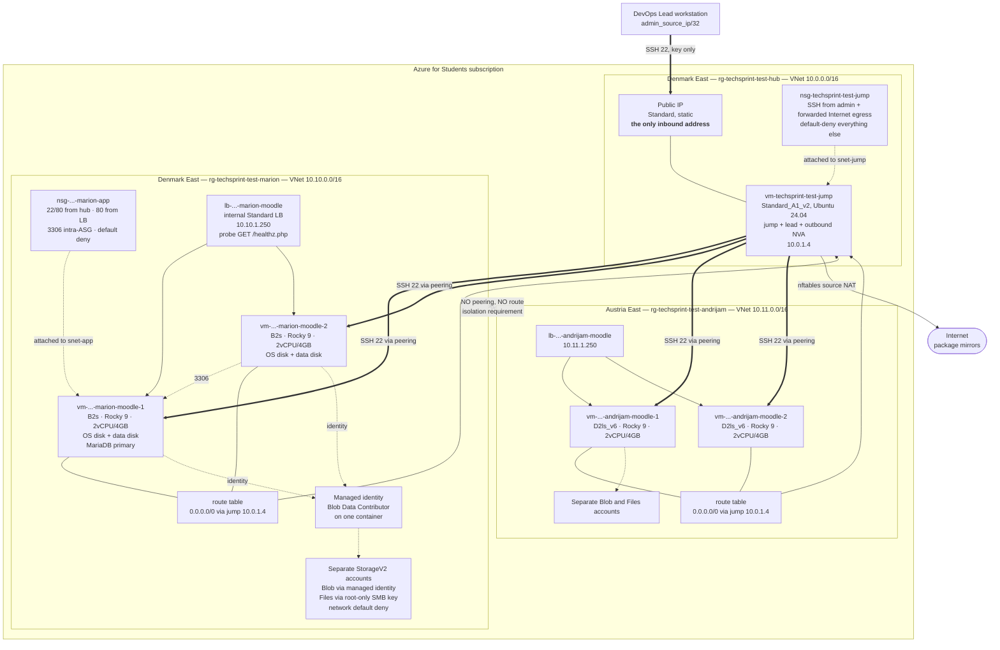

# Azure architecture diagram

**Worth 3 points (I4).** Export the rendered diagram as an image for the
document; Mermaid renders on GitHub and in most Markdown tooling.

Shown with two developers, which is the minimum the brief requires. A third CSV
row adds a third spoke and changes nothing else.

---

## Full deployment



## Why hub-and-spoke

Two requirements pull in opposite directions:

- *"Virtualne mašine različitih programera ne smiju međusobno komunicirati."*
- *"Kreirajte centralni VM za voditelja tima koji će se moći spojiti na sve
  ostale VM-ove."*

The lead needs to reach everything; developers must reach nothing but their own.
Hub-and-spoke satisfies both because **Azure VNet peering is not transitive**.
Each spoke peers to the hub and to no other spoke. Two spokes sharing a common
hub normally have no route to each other. Here the jump also forwards Internet
egress, but the hub NSG permits forwarded traffic only when its destination is
the `Internet` service tag; its default inbound rule rejects other forwarded
traffic. The jump host's nftables policy also drops private-to-private forwarding.

Verify the claim rather than asserting it:

```bash
# Each spoke has exactly one peering, and it points at the hub
az network vnet peering list \
  --resource-group rg-techsprint-test-marion \
  --vnet-name vnet-techsprint-test-marion \
  --query "[].{name:name, remote:remoteVirtualNetwork.id, state:peeringState}" -o table

# Forwarding is enabled for NVA egress and constrained by NSGs
az network vnet peering list \
  --resource-group rg-techsprint-test-marion \
  --vnet-name vnet-techsprint-test-marion \
  --query "[].allowForwardedTraffic" -o tsv
# true
```

## Traffic paths

| # | Path | Route | Control |
|---|---|---|---|
| 1 | Lead → bastion | internet → public IP | NSG: 22/tcp from `admin_source_ip/32` only |
| 2 | Bastion → any Moodle node | hub → peering → spoke | hub outbound and spoke inbound NSGs allow only 22/80 |
| 3 | Client → Moodle | SSH tunnel through the bastion → internal LB → node | LB probe removes unhealthy nodes |
| 4 | Moodle node → internet | spoke UDR → jump/NVA → internet | IP forwarding + nftables; hub NSG permits Internet destinations only |
| 5 | Moodle node → blob | service endpoint → private Blob container | subnet firewall + managed identity scoped to that container |
| 6 | Moodle node → file share | service endpoint → Files-only account | subnet firewall + account key in a root-only file |
| 7 | Node 2 → node 1 database | inside `snet-app` | NSG: 3306 between ASG members only |
| 8 | Developer A → developer B | **no direct route exists** | no spoke peering; NVA default-drop policy |

## The public IP question

There is exactly one public IP resource, matching the literal rubric:

| Public IP | Attached to | Accepts inbound? |
|---|---|---|
| `pip-techsprint-test-jump` | the bastion NIC | Yes — 22/tcp from one address. This is the intended single entry point. |

No Moodle VM has a public IP at all:

```bash
# Every NIC in every developer group. publicIpAddress must be null everywhere.
az network nic list --query \
  "[?contains(resourceGroup, 'techsprint')].{nic:name, rg:resourceGroup, publicIp:ipConfigurations[0].publicIpAddress.id}" \
  -o table
```

## Naming visible in the diagram

`<type>-<project>-<env>-<scope>-<index>`, so a resource's owner and purpose are
readable without opening it. Full convention in
[../architecture.md](../architecture.md#naming-convention-and-tagging).
