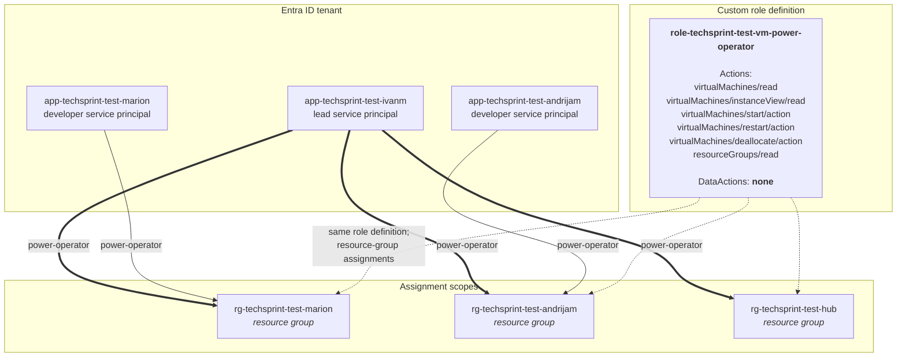

# Azure RBAC model diagram

**Worth 3 points (I5).** Export the rendered diagram for the document.

---

## The model



Assignments are direct. A shared developer group cannot express a different
resource-group scope for each member, and a separate one-member group per
developer would add objects without changing authorization. The custom role
already includes the read actions needed for the CLI demo, so a second `Reader`
assignment is also unnecessary.

## Why a custom role and not `Virtual Machine Contributor`

The requirement is exact: *"Programeri moraju moći sami pokrenuti, ugasiti i
ponovno pokrenuti isključivo svoje VM-ove"* — start, stop, restart. Nothing
about creating, deleting or resizing.

`Virtual Machine Contributor` grants `Microsoft.Compute/virtualMachines/*`,
which includes `delete`, `write` and disk attachment. A developer holding it
could destroy their own environment, resize a B2s into something that eats the
whole credit, or attach someone else's disk. That is not "minimalno potrebnim
pravima", and the rubric awards 2 points specifically for minimum rights.

| Capability | Custom power-operator | Virtual Machine Contributor |
|---|---|---|
| Start / restart / deallocate | yes | yes |
| Read VM and its metrics | yes | yes |
| **Delete a VM** | **no** | yes |
| **Resize a VM** | **no** | yes |
| **Attach or detach disks** | **no** | yes |
| **Create a new VM** | **no** | yes |
| **Read blob data** | **no** | no (data plane is separate) |

## Scope is what enforces "only their own"

Azure RBAC inherits downward: an assignment at subscription scope applies to
every resource group beneath it, and one at resource-group scope applies only
inside that group. So the same role definition produces two very different
outcomes depending on where it is assigned.

- **Developer identity:** assigned at `rg-techsprint-test-marion`. Mario's
  CSV-generated service principal can power-cycle
  the two VMs in that group. Andrija's group is a sibling, not a child, so no
  assignment reaches it. This is why the design puts one resource group per
  developer — the group *is* the permission boundary.
- **Lead identity:** assigned directly to every TechSprint developer resource
  group plus the hub. This gives complete project control without granting
  Reader or power rights over unrelated resources elsewhere in the subscription.

## Verify it, do not assert it

The university tenant does not permit students to create human users. The
official Azure rubric requires automated identities and scoped RBAC, so the
lecturer approved creating one application/service principal per CSV row. The
strongest evidence is still a negative test: authenticate as one developer
identity and fail to touch another's VM.

```bash
# What Mario can actually do, according to Azure
az role assignment list --assignee <marion-client-id> --all \
  --query "[].{role:roleDefinitionName, scope:scope}" -o table
```

```
Role                                       Scope
-----------------------------------------  --------------------------------------------------
role-techsprint-test-vm-power-operator     /subscriptions/<id>/resourceGroups/rg-...-marion
```

```bash
# Sign in as Mario's CSV-generated service principal. Read the secret without
# echoing it or storing it in shell history.
read -s AZURE_CLIENT_SECRET
az login --service-principal \
  --username <marion-client-id> \
  --password "$AZURE_CLIENT_SECRET" \
  --tenant <tenant-id>
unset AZURE_CLIENT_SECRET

# 1. Own VM, allowed action -> succeeds
az vm restart -g rg-techsprint-test-marion -n vm-techsprint-test-marion-moodle-1

# 2. Own VM, forbidden action -> AuthorizationFailed
az vm delete -g rg-techsprint-test-marion -n vm-techsprint-test-marion-moodle-1 --yes
#   (AuthorizationFailed) The client '<service-principal-id>' does not
#   have authorization to perform action 'Microsoft.Compute/virtualMachines/delete'

# 3. Another developer's VM -> AuthorizationFailed, and it is not even listed
az vm restart -g rg-techsprint-test-andrijam -n vm-techsprint-test-andrijam-moodle-1
az vm list -o table    # only Mario's own VMs appear
```

Screenshot outcomes 2 and 3. An allow test proves a rule exists; a **deny** test
proves the rule is the thing doing the work.

## Control plane versus data plane

Worth one paragraph, because it surprises people and it explains a deliberate
choice in the design.

Azure separates *management* permissions (`actions`) from *data* permissions
(`dataActions`). Being subscription Owner does not let you read a blob. The
power-operator role has `dataActions = []`, so a developer can restart the VM
that serves Moodle but cannot read the Moodle files in blob storage from their
own account.

Blob access instead belongs to the **VM's user-assigned managed identity**,
which holds `Storage Blob Data Contributor` on exactly one container. So:

- the operator identity can control the machine but not read the data,
- the machine can read the data but is not a human identity that can be phished,
- and no storage account key is written to disk for blob access at all, which
  `lib/verify.sh` asserts:

```bash
# From the rubric-mapped verifier
check "I4" "blob configuration uses managed identity" \
  on_node "$ip" "grep -q 'mode: msi' /etc/blobfuse2-techsprint.yaml"
```

The Azure Files mount uses a separate file-only account key in a `0600`
root-owned file referenced by fstab. It cannot access the Blob account.
Identity-based SMB remains future work because it requires Linux
domain/Kerberos tooling; the Blob path itself remains keyless.

## Identity summary from Terraform

```bash
terraform -chdir=iac/azure output identity_summary
```

```
{
  "custom_role" = "role-techsprint-test-vm-power-operator"
  "developers" = {
    "marion" = {
      "identity_type" = "service_principal"
      "client_id"     = "<client-id>"
      "rights"        = "start / restart / deallocate + read, own resource group only"
      "scope"         = "rg-techsprint-test-marion"
    }
    ...
  }
  "leads" = {
    "ivanm" = {
      "identity_type" = "service_principal"
      "client_id"     = "<client-id>"
      "rights"        = "start / restart / deallocate + read, every environment"
      "scope"         = "all TechSprint resource groups"
    }
  }
}
```
