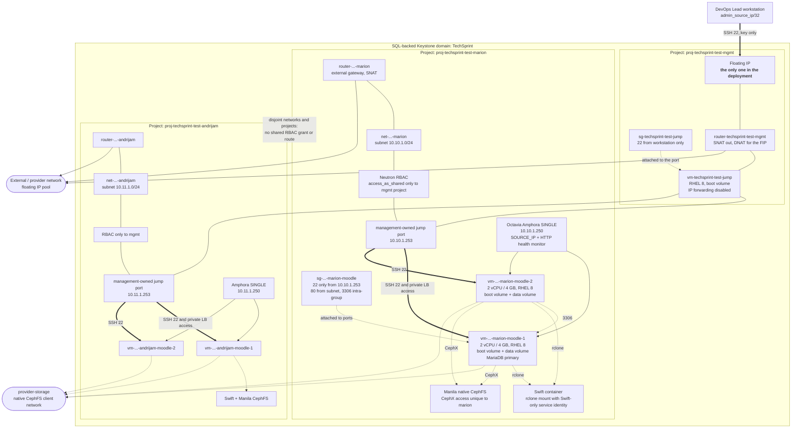

# OpenStack architecture diagram

**Worth 3 points (I2).** Export the rendered diagram for the document.

Horizon draws an authoritative version for you as well — *Project → Network →
Network Topology*. Include both: the hand-made one shows the design, the Horizon
screenshot proves it exists.

---

## Full deployment



## Why a project per developer

Azure isolates with a resource group inside one subscription. OpenStack uses a
dedicated SQL-backed domain and a **Keystone project** per developer. Networks,
quotas, instances, volumes, Swift containers and Manila shares are created with
a token scoped to that project. A developer with no role in another project
cannot obtain a token for it.

The lead's data-plane access is separate from that identity boundary. Each
developer network grants `access_as_shared` to the management project only.
That project owns one fixed `.253` port in each network, attached to the central
jump VM. The bounded RHOSP probe proved this ownership model before it was added
to Terraform. Because IP forwarding is disabled, the jump initiates SSH and
Moodle traffic but cannot route packets between developer networks.

That is a genuinely better isolation story than the Azure side, and it is worth
saying so in the comparison section. The trade-off appears in
[openstack-iam.md](openstack-iam.md): OpenStack has no equivalent of Azure's
custom "power state only" role without a Nova policy override.

```bash
# Prove the isolation: as developer A, try to see developer B's project
export OS_USERNAME=mario.nikolis OS_PROJECT_NAME=proj-techsprint-test-andrijam
openstack server list
# You are not authorized to perform the requested action.   <- correct
```

## Layer-by-layer

| Layer | Resource | Requirement it satisfies |
|---|---|---|
| Identity | one project per developer | *"Kreirani odvojeni projekti/tenanti za izolaciju"* |
| Network | one Neutron network + subnet per project | *"Svaki programer ima svoju izoliranu virtualnu mrežu"* |
| Routing | router with external gateway, SNAT | *"VM-ovi moraju moći pristupiti Internetu"* |
| Ingress | one floating IP, on the bastion only | *"Ne smije postojati izravan javni pristup ostalim instancama"* |
| Firewall | security group per project, `remote_group_id` for intra-tier | *"Pravilno kreirane security grupe"* |
| Balancing | Octavia Amphora `SINGLE`, HTTP health monitor | *"Implementiran load balancer"* |
| Compute | 2 instances, private 2-vCPU/4096-MB flavor, RHEL 8 cloud image | hardware and OS requirements, plus HA |
| Block storage | boot volume + data volume per instance | *"dva diska (OS disk i data disk)"* |
| Object storage | Swift container | *"servisa za objektnu pohranu"* |
| File storage | Manila native CephFS with CephX access | *"servisa za datotečnu pohranu"* |

## The floating-IP DNAT detail

A floating IP is **not** configured on the instance. The router does DNAT, so
`ip addr` inside the bastion shows only `10.100.0.x`, forever. Every student
trips over this once; explaining it correctly shows you understand Neutron
rather than having copied commands.

```bash
openstack floating ip list -f table
# +---------------------+------------------+
# | Floating IP Address | Fixed IP Address |
# +---------------------+------------------+
# | 172.25.250.108      | 10.100.0.12      |
# +---------------------+------------------+

ssh cloud-user@172.25.250.108 'ip -4 addr show | grep inet'
#     inet 10.100.0.12/24 ...      <- the floating IP is nowhere on the guest
```

## MTU, if you hit it

Lab tenant networks usually run over VXLAN or GENEVE, so the MTU is 1442 or
1450 rather than 1500. Symptom: SSH connects then hangs, `curl` returns headers
and stalls, `ping` is fine. Check yours and mention it if it affected you:

```bash
openstack network show net-techsprint-test-marion -f value -c mtu
```

## Lab capabilities established before implementation

Read-only discovery and a bounded create/delete probe established that this
RHOSP 16.1 lab provides Swift, native CephFS Manila and Octavia. OVN consumes no
VM but this RHOSP version lacks health monitors. The implementation therefore
uses an Amphora `SINGLE` flavor profile: one 1-GB amphora per developer load
balancer, with the HTTP monitor required for a meaningful failover demo.

The same probe proved the SQL identity domain, exact private application flavor,
CephFS share-type metadata, project-specific network RBAC and management-owned
cross-project ports. Workload behavior remains explicitly unverified until the
runtime smoke test.
