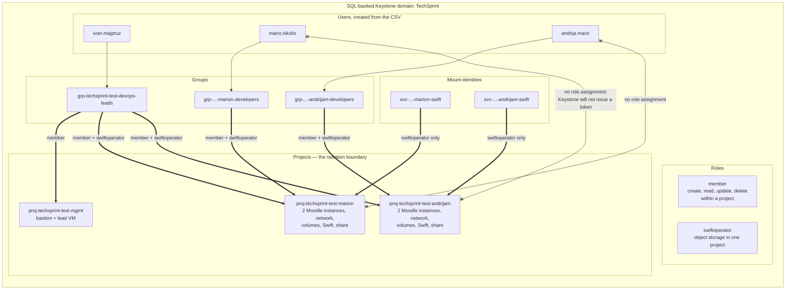

# OpenStack IAM structure diagram

**Worth 3 points (I3).** Export the rendered diagram for the document.

---

## The model



## The four-part Keystone model

Azure has tenant → subscription → resource group → resource. Keystone has
**domain → project → user/group → role assignment**, and the role assignment is
a *triple*: (actor, target, role). That triple is the whole authorisation model.

| Keystone | Nearest Azure equivalent | Difference that matters here |
|---|---|---|
| Domain | Entra ID tenant | A domain namespaces users *and* projects; an Azure tenant namespaces only identities |
| Project | Resource group | A project also scopes quotas, networks and images. A resource group scopes none of those |
| User | Entra ID user | Same idea |
| Group | Security group | Same idea |
| Role assignment (user, project, role) | Role assignment (principal, scope, role) | Keystone has no inheritance by default: a role on a parent project does not reach its children unless the deployment enables hierarchical multitenancy |

That last row is the interesting one. Azure RBAC can inherit downward, but this
project deliberately assigns the lead per TechSprint resource group to avoid
unrelated subscription access. Keystone does not inherit, so the OpenStack lead
also needs **one assignment per project** — which is exactly why
`iac/openstack/main.tf` loops:

```hcl
resource "openstack_identity_role_assignment_v3" "lead_all_projects" {
  for_each = var.developers

  group_id   = openstack_identity_group_v3.leads.id
  project_id = openstack_identity_project_v3.developer[each.key].id
  role_id    = data.openstack_identity_role_v3.member.id
}
```

Adding a developer to the CSV therefore creates their project *and* the lead's
assignment into it, in the same apply. Nothing to remember by hand.

## Why the isolation is stronger than Azure's

A developer with no role in another project cannot obtain a **token** scoped to
it. Not "can see it but gets denied on write" — Keystone refuses to authenticate
them into that scope at all. The API returns 401/403 before any Nova or Neutron
policy is consulted.

```bash
# As Mario, try to scope into Andrija's project
export OS_USERNAME=mario.nikolis
export OS_PROJECT_NAME=proj-techsprint-test-andrijam
openstack token issue
# The request you have made requires authentication.  <- Keystone, not Nova

# Scoped correctly, everything works
export OS_PROJECT_NAME=proj-techsprint-test-marion
openstack server list -f table
# only Mario's two instances
```

Compare with Azure's resource-group-scoped custom role. Keystone's project
boundary also scopes the token itself, which is the strongest point the
OpenStack side has in the comparison section.

## The honest weakness: no power-state-only role

The brief asks for developers who can *only* start, stop and restart. Azure has
this exactly, via the custom role in
[azure-rbac.md](azure-rbac.md). OpenStack does not, out of the box:

- Default `member` can create and **delete** servers as well as start and stop
  them.
- Default `reader` can start nothing.
- There is no built-in role between the two.

Narrowing `member` means overriding Nova's `policy.yaml` on the API nodes:

```yaml
# /etc/nova/policy.yaml on the controllers - NOT installable by a tenant
"os_compute_api:servers:delete": "role:admin"
"os_compute_api:servers:create": "role:admin"
"os_compute_api:servers:start":  "role:member"
"os_compute_api:servers:stop":   "role:member"
```

That is a cloud-operator action. On a shared Red Hat Academy lab you have no
access to the controllers, so it is not available to a student project.

**What to write:** the requirement is met on OpenStack through the *project*
boundary rather than through a narrow role. A developer can delete their own
instance — which the brief does not ask to prevent — but cannot touch anyone
else's, which is what it does ask. State the limitation and the production fix.
An examiner will value the analysis more than a claim that the two clouds came
out identical.

If your lab does grant you an admin account on a dedicated deployment, the
policy override above is the full-credit answer and worth mentioning either way.

## Evidence to capture

```bash
# 1. Projects created, one per developer plus management
openstack project list --domain TechSprint -f table

# 2. Users created from the CSV, with their default project
openstack user list --domain TechSprint -f table
openstack user show --domain TechSprint mario.nikolis \
  -f table -c name -c default_project_id -c enabled

# 3. Group membership
openstack group contains user \
  --group-domain TechSprint --user-domain TechSprint \
  grp-techsprint-test-marion-developers mario.nikolis
openstack group contains user \
  --group-domain TechSprint --user-domain TechSprint \
  grp-techsprint-test-devops-leads ivan.majpruz

# 4. The assignment triples - this table is the diagram, as data
openstack role assignment list --names -f table
```

```
+--------+-------------------------+--------------------------------+---------------------------------+
| Role   | User                    | Group                          | Project                         |
+--------+-------------------------+--------------------------------+---------------------------------+
| member |                         | grp-...-marion-developers     | proj-techsprint-test-marion      |
| swiftoperator |                  | grp-...-marion-developers     | proj-techsprint-test-marion      |
| member |                         | grp-...-andrijam-developers   | proj-techsprint-test-andrijam    |
| swiftoperator |                  | grp-...-andrijam-developers   | proj-techsprint-test-andrijam    |
| member |                         | grp-...-devops-leads          | proj-techsprint-test-marion      |
| swiftoperator |                  | grp-...-devops-leads          | proj-techsprint-test-marion      |
| member |                         | grp-...-devops-leads          | proj-techsprint-test-andrijam    |
| swiftoperator |                  | grp-...-devops-leads          | proj-techsprint-test-andrijam    |
| member |                         | grp-...-devops-leads          | proj-techsprint-test-mgmt        |
+--------+-------------------------+--------------------------------+---------------------------------+
```

Read that table against the diagram: every developer-specific group appears in
one project, while the leads group appears in all projects.

```bash
# 5. The negative test - the highest-value evidence
OS_USERNAME=mario.nikolis OS_PROJECT_NAME=proj-techsprint-test-andrijam \
  openstack server list
# Expect an authentication or authorization failure. Screenshot it.

# 6. Terraform's own summary
terraform -chdir=iac/openstack output identity_summary
```
